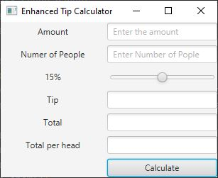
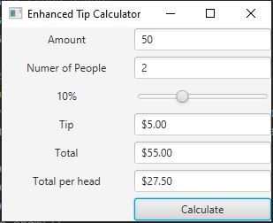
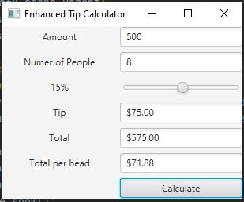
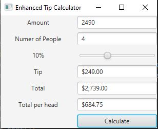

# Echanced tip calculator application using javafx and scenebuilder

## Jahanzaib Danish
##

# Software needed for this application
## JavaFX SDK ( https://openjfx.io/
## Scene Builder (https://gluonhq.com/products/scene-builder/)
## IntelliJ IDEA ( https://www.jetbrains.com/idea/
##
## In order to setup JavaFX project, follow the instruction on this link: (https://openjfx.io/openjfx/docs/#introduction)

#

#

#

